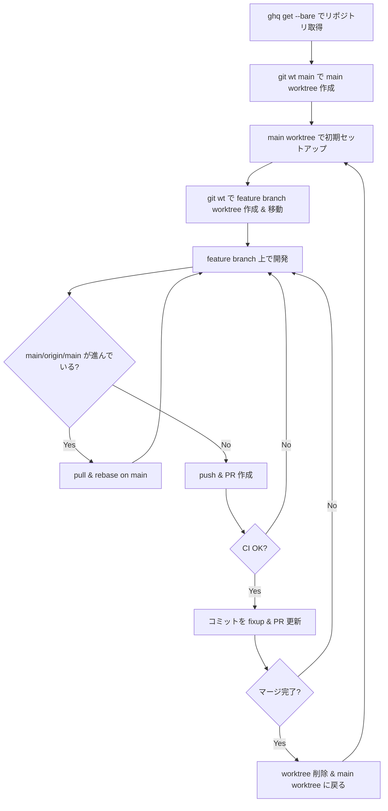

# Git ワークフロー: ghq bare + git-wt ベースの開発フロー

ghq の bare clone と git-wt (worktree) を組み合わせた開発ワークフロー。
bare リポジトリをベースに、ブランチごとに独立した worktree で作業することで、
コンテキストスイッチのコストを最小化する。

## 前提ツール

| ツール | 用途 | インストール |
|--------|------|------------|
| [ghq](https://github.com/x-motemen/ghq) | リポジトリ管理 | `brew install ghq` |
| [git-wt](https://github.com/k1LoW/git-wt) | worktree 操作 | `brew install k1LoW/tap/git-wt` |
| [gh](https://github.com/cli/cli) | GitHub CLI | `brew install gh` |
| [gh-poi](https://github.com/seachicken/gh-poi) | マージ済みブランチ削除 | `gh extension install seachicken/gh-poi` |

## ワークフロー全体図



## 各ステップの詳細

### 1. bare clone でリポジトリ取得

```bash
ghq get --bare <repo-url>
```

`ghq.root` (= `~/src`) 配下に bare リポジトリとしてクローンされる。
bare clone は作業ディレクトリを持たないため、全ブランチを worktree で管理する前提。

### 2. main worktree 作成

```bash
git wt main
```

bare リポジトリから main ブランチの worktree を作成し、そのディレクトリに移動する。
`wt.basedir` 設定により、worktree は `../worktrees/{gitroot}` に配置される。

### 3. 初期セットアップ

main worktree 内でプロジェクト固有のセットアップを行う。

```bash
# 例: 依存インストール、環境変数設定など
npm install          # Node.js プロジェクト
task setup           # go-task ベースのプロジェクト
direnv allow         # .envrc がある場合 (wt.hook で自動実行)
```

### 4. feature branch worktree 作成 & 移動

```bash
git wt <feature-branch>
```

新規ブランチの場合は自動で作成され、worktree に移動する。
`wt.copyignored`, `wt.copyuntracked`, `wt.copymodified` が `true` のため、
`.envrc` などの環境設定ファイルが自動的にコピーされる。

### 5. feature branch 上で開発

通常の git 操作で開発を進める。worktree ごとにディレクトリが分かれているため、
他のブランチの作業に影響を与えない。

### 6. pull & rebase on main

origin/main が進んでいる場合、rebase で追従する。

```bash
git fetch origin
git rebase origin/main
```

> `pull.rebase = true` が設定されているため、`git pull` でも自動的に rebase される。

### 7. push & PR 作成

```bash
git push -u origin <feature-branch>
gh pr create --draft
```

Draft PR で作成し、CI の結果を確認する。

### 8. コミットを fixup & PR 更新

CI が通ったら、コミットを整理して PR を更新する。

```bash
# コミットを fixup で整理
git rebase -i origin/main
# force push で PR 更新
git push --force-with-lease
# PR のタイトル・本文を更新
gh pr edit
```

### 9. worktree 削除 & main に戻る

マージ完了後、feature branch の worktree を削除して main に戻る。

```bash
# main worktree に移動してクリーンアップ
git mc
# → git switch main && git pull --tags origin HEAD && gh poi
```

`git mc` エイリアスは以下を一括実行する:
- main ブランチに切り替え
- 最新を pull
- `gh poi` でマージ済みブランチを自動削除

不要な worktree を個別に削除する場合:

```bash
git wt -d <feature-branch>
```

## 関連設定

このワークフローを支える git config 設定 (`config/git/config`):

```ini
[ghq]
    root = ~/src
[pull]
    rebase = true
    ff = only
[fetch]
    prune = true
[wt]
    copyignored = true
    copyuntracked = true
    copymodified = true
    hook = test -f .envrc && direnv allow || true
    basedir = ../worktrees/{gitroot}
[alias]
    mc = !git switch $(git symbolic-ref refs/remotes/origin/HEAD | sed 's@^refs/remotes/origin/@@') && git pull --tags origin HEAD && gh poi
```
